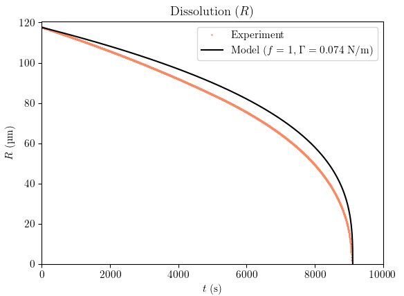

# Bubbledissolution

Brice Saint-Michel (from `univ-eiffel.fr`)

This is a repository that tries to model bubble dissolution in yield-stress fluids, based on :

* [_Diffusion-induced Growth and Collapse of Bubbles in YS Fluids_ by Venerus, JNNFM (2015)](https://www.sciencedirect.com/science/article/pii/S037702571400202X) 
* [_Effect of bulk and interfacial rheological properties on bubble dissolution_ from Kloek _et al._, JCIS (2001)](https://www.sciencedirect.com/science/article/pii/S0021979701974545)
* [_Factors determining the stability of a gas cell in an elastic medium_ by Fyrillas _et al_., Langmuir (2000)](https://pubs.acs.org/doi/abs/10.1021/la990784y)

And of course a bit of the book by Chris Macosko.

The repo mainly consists of [a Jupyter Notebook](./Bubble_Dissolution_alaVenerus.ipynb) calling a few [functions](./functions) that compute the relevant quantities during bubble dissolution, i.e. the extent of the yielded region. A `bubble` object is introduced and contains all the physical quantities related to the physical problem (initial radius, matrix elasticity, Henry's law constant, ...) 

## The physics

### Basic quantities

We consider here the dissolution of small bubbles in a Carbopol. We have : 

* $R_0 = 10^{-4}~{\text m}$ the initial bubble radius
* $\Gamma = 0.07~{\rm N}.{\rm m}^{-1}$ the Carbopol surface tension, which is reasonable considering independent experiments done here and the existing literature.
* $\rho = 1000~{\rm kg}.{\rm m}^{-3}$ the Carbopol density
* $p_0 = 1.013 \times 10^5~{\rm Pa}$ is the ambient pressure.
* $T=298~{\rm K}$ the temperature
* $A p_0 = M \bar{\rho_0}/ \mathcal{R} T = 1.3~{\rm kg}.{\rm m}^{-3}$ is the density of the bubble in the absence of surface tension, elasticity, etc., with ${\cal R}$ the ideal gas constant and $M$ the molar mass of the gas.
* $k_H p_0 = 2.0 . 10^{-5}$ the (dimensionless) Henry's law constant giving the mass fraction $w$ of dissolved gas in water at thermal equilibrium at a pressure $p_0$ in water (I consider that it will be the same in Carbopol)
* $\sigma_{\rm Y} = 9.5~{\rm Pa}$ is the yield stress of the Carbopol 
* $\eta = 7~{\rm Pa}.{\rm s}$ has been obtained from a very crude linear approximation of the extra stress in the Carbopol between $\dot\gamma = 0$ and $\dot\gamma = 1~{\rm s}^{-1}$ 
* $G = 90~{\rm Pa}$ the linear shear elastic modulus of the Carbopol
* $D = 2.0 \times 10^{-9}~{\rm m}^2.{\rm s}^{-1}$ is the diffusion coefficient of air in water (I consider it will be the same in Carbopol) 

### Forcing and simplifications related to weak forcing

There is a difference between the paper and our experiments. In the Venerus paper, _at the initial stage_, a bubble is at equilibrium with its surroundings with a pressure outside the bubble being uniform and set to $p_0 + \Delta p_0$. We then suddenly change the pressure to $p_0$ to drive bubble dissolution (if $\Delta p_0 \leq 0$) or growth ($\Delta p_0 \geq 0$). The amplitude of the forcing term is being computed as 

$$ N_a = \frac{w_0 - w_1}{1 - w_1} \frac{\rho}{A p_0} $$

where  $w_0 = k_H (p_0 + \Delta p)$ is the mass fraction of solute initially and $w_1 = k_H p_0$ is another characteristic mass fraction.

In our experiments, we are injecting a bubble in a medium where, originally, we expect equilibrium with the outside air, so $w(t < 0) = w_1$. This corresponds more closely to the Fyrillas and Kloek papers. I interpret our experiment -- from the point of view of the Venerus JNNFM paper -- as a sudden switch of surface tension, elasticity and plasticity effects at $t = 0^+$, leading to an initial additional pressure term $\Delta p = 2\Gamma / R_0$. This bubble would indeed be in equilibrium with a medium with a solute mass fraction $w = w_0$ choosing $\Delta p = 2 \Gamma / R_0$, $\Gamma$ being the matrix surface tension and $R_0$ the initial bubble radius. 

Notations are then a bit reversed between the paper and our experiments between $w_0$ and $w_1$, but the absolute value of $N_a$ is really what matters, and we can estimate it for a typical experiment in Carbopol. In any case we are well in the $w_1 \ll 1$ regime, leading to : 

$$ N_a = k_H \frac{2 \Gamma}{R_0} \frac{\rho}{A p_0}  = 2 \times 10^{-4} \to 0$$

### Other dimensionless quantities

Considering the properties of the Carbopol, we are fully in the "diffusion-controlled" case : 

$$ N_{\rm p} = \frac{\eta D}{R_0^2 p_0} = 1.4 \times 10^{-5} $$ 

The normalised pressure term $N_{\Delta p}$ can also be computed. The initial relative pressure change in the bubble is small : 

$$ N_{\rm \Delta p } = \left ( 1 + \frac{2 \Gamma}{ R_0 p_0} \right )^{-1} = 0.985$$

The capillary number can also be estimated, and is again small : 

$$ N_{\rm Ca} = \eta D / \Gamma R_0 = 2 \times 10^{-3}$$

We can also estimate the typical yield-strain ratio of the Carbopol which is typical for all the Carbopols I have been using :

$$ N_\sigma = \frac{\sigma_{\rm Y}}{G} = 0.1 $$

We also estimate the Deborah number, which is also small : 

$$ N_{\rm De} = \eta D/ G R_0^2 = 0.015 $$ 

And finally, the Bingham number, which is relatively large : 

$$ N_{\rm Bn} = \sigma R_0^2 / D \eta = 7 $$

### The bubble pressure as a function of current and initial radii

Here, we blindly follow the results of Venerus JNNFM (2015), Equation (22) to express the pressure inside the difference between the pressure inside bubble $p(R)$ and the pressure in the matrix far from it, $p_0$: 

$$ p - p_0 = \frac{2 \Gamma}{R} \pm 2 \sqrt{3}\sigma_{\rm Y} \ln \left ( \frac{S}{R}\right ) + G \left [ \frac{5}{2} - \frac{1}{2} \left (1 -\frac{R^3 - R_0^3}{S^3} \right )^{1/3} \left ( 5 - \frac{R^3 - R_0^3}{S^3}\right ) \right ] $$

$S$ being the size of the (spherical) yielded region, which itself depends on $R$ and $R_0$ (Equation 20 from Venerus JNNFM) : 

$$\left [\left (1 - \frac{R^3 - R_0^3}{S^3} \right)^{4/3} - 1 \right ]^2 +
  \left [\left (1 - \frac{R^3 - R_0^3}{S^3} \right)^{-2/3} - 1 \right]^2 = 2 \left (\frac{\sigma}{G} \right )^2$$

We are currently double-checking the equations for the bubble pressure in the plastic regime, since the additional stress tensor $\tau$ is not necessarily traceless for large deformations and it usually causes a bit of trouble in the derivation of the matrix terms for $p$.

### Ordinary differential equation for the evolution of R

The 2015 JNNFM paper does not really provide an explicit (ordinary) differential equation to solve to obtain $R(t)$ for a bubble dissolving in a yield-stress (un-)saturated fluid. We can use the results of the [Fyrillas _et al_. (2000)](https://pubs.acs.org/doi/full/10.1021/la990784y) paper [Equation (2.4) notably] and that of [Kloek _et al._(2001)](https://doi.org/10.1006/jcis.2001.7454), still ignoring the viscous contributions, which would introduce another $\dot{R}$ (admittedly annoying) term: 

$$ \dot{R} = - 3  D \mathcal{R} T k_H \frac{p(R) - c_0 / k_H}{\Big [ 3 p(R) + R \partial_R [p(R)] \Big ] } \left ( \frac{1}{R} + \sqrt\frac{1}{\pi D t} \right ) $$ 

Here, we have used the _molar concentration_ $c_0$ of the dissolved gas rather than the mass fraction $w_0$. They are naturally related, and for the low solute concentrations we are considering, we can more simply use $c = x \rho / M$. Computing the solution of the above differential equation, we need  to use another interpolating function to compute $\partial_R [p(R)]$, as a function of $R$ and $R_0$. The value $c_0 / k_H$ here simply represents the pressure that the bubble needs to match to stop dissolving.  If the surrounding medium is initially at thermodynamic equilibrium with its surroundings, we can safely assume that $c_0 /k_H = p_0$, but sometimes the surrounding medium is not fully saturated with gas ; we then use $c_0 / k_H = f p_0$ with $f$ the _saturation_ factor.

We note that $k_H \mathcal{R} T$ is a dimensionless group, highlighting the need to make the equations dimensionless by using $D$. We can follow the conventions of either Venerus or Kloek _et al_., which are essentially the same, using $\epsilon = R/R_0$ as done above and $x^2 = D t / R_0^2$. We can then rewrite our differential equation, writing $\tilde{p} = p(R)/p_0$ :

$$ \frac{\partial \epsilon}{\partial x} = - 6 k_H \mathcal{R} T \frac{\tilde{p} - f}{3 \tilde{p} + \epsilon \partial \tilde{p} / \partial \epsilon} \left ( \frac{x}{\epsilon} + \frac{1}{\sqrt{\pi}} \right ) $$

### Model results 

Check out the [Jupyter Notebook](./Bubble_Dissolution_alaVenerus.ipynb) for more details. 

The figure below plots the size of the yielded region as a function of $R/R_0$ for our Carbopol (left panel) and the contributions to $p$ for $R/R_0$ again (right panel). We see that the influence of the matrix is really small overall. It should have a limited impact on bubble dissolution.

.

The figure below shows the expected time profiles for bubble dissolution for three fluids : a Newtonian fluid (with zero viscosity), our weak Carbopol with $\sigma_Y \simeq 10$ Pa and a stronger Carbopol. We see that the difference between our Carbopol and an inviscid liquid is almost negligible.

### Comparison with experiments

The experimental dissolution profiles I obtained are shown in the figure below (square symbols), with the Carbopol properties used in the previous section and $R_0 = 117$ µm, which should not drastically change the dimensionless numbers we have been using previously. We immediately see that the fit and the data do not match very well.

.

We can try to be a bit better and adjust the surface tension to match the dissolution time. In such a case, the experimental dissolution _profile_ still does not match the model :

.

We can finally try to adjust _both_ the under-saturation factor $f$ and the surface tension $\Gamma$. In that case, we _do_ get a good match, but the typical value for surface tension becomes very low :

.

(the dissolution profiles have been fitted using a different algorithm, based on the explicit solution of [Michelin _et al._](https://doi.org/10.1103/PhysRevFluids.3.043601), which assume a low-viscosity Newtonian surrounding matrix)

The saturation factor around $0.99$ is understandable considering weather variability. I have never managed to obtain reliably $f = 1.000$, even though I drew my DI water around 1 month before I prepare my Carbopol and despite waiting for more than a week before starting experiments in a temperature-controlled cell of size $5 \times 5 \times 5~\text{cm}^3$. The values I obtain usually fall into the range $[0.975\,;\,0.998]$, but differ from one bubble to the next, irrespective of whether I stir the fluid between experiments, and irrespective of the bubble injection depth.

I am really puzzled by this _effective_ surface tension, which is too low, and seems to be decreasing with increasing yield stress. Here, the value extracted from the fit lies around $[0.02\,;\,0.04]$, with again poor repeatability for a range of yield stresses $\sigma_Y$ under 10 Pa, even though I took particular care of trying to get rid of impurities and dust.

